# Chan Theory (缠论) Complete Tutorial

## A Beginner's Guide to the "Teaching You Stock Trading" (教你炒股票) Technical Analysis System

> **Based on the 108 lessons of 缠中说禅 (Chan Zhong Shuo Chan)**
> Implementation: [`chan_theory/`](../chan_theory/) package

---

## Table of Contents

1. [What is Chan Theory?](#1-what-is-chan-theory)
2. [Prerequisites: Understanding the A-Share Stock Market](#2-prerequisites-understanding-the-a-share-stock-market)
3. [K-lines: The Language of the Market](#3-k-lines-the-language-of-the-market)
4. [Step 1: Inclusion Handling (包含处理)](#4-step-1-inclusion-handling-包含处理)
5. [Step 2: Fractals (分型)](#5-step-2-fractals-分型)
6. [Step 3: Bi / Strokes (笔)](#6-step-3-bi--strokes-笔)
7. [Step 4: Segments (线段)](#7-step-4-segments-线段)
8. [Step 5: Central Hubs (中枢) — The Core of Everything](#8-step-5-central-hubs-中枢--the-core-of-everything)
9. [Trend vs Consolidation (趋势与盘整)](#9-trend-vs-consolidation-趋势与盘整)
10. [Divergence (背驰) — Predicting Reversals](#10-divergence-背驰--predicting-reversals)
11. [The Three Classes of Buy/Sell Points (三类买卖点)](#11-the-three-classes-of-buysell-points-三类买卖点)
12. [Hub Extension, Expansion & Migration](#12-hub-extension-expansion--migration)
13. [After Divergence: Three Possible Outcomes (Lesson 29)](#13-after-divergence-three-possible-outcomes-lesson-29)
14. [Auxiliary Indicators: MA Kisses, Bollinger, Gaps](#14-auxiliary-indicators-ma-kisses-bollinger-gaps)
15. [Multi-Level Analysis & Interval Nesting (区间套)](#15-multi-level-analysis--interval-nesting-区间套)
16. [Trading Strategies](#16-trading-strategies)
17. [Complete Pipeline: Putting It All Together](#17-complete-pipeline-putting-it-all-together)
18. [Running the Demo](#18-running-the-demo)
19. [Quick Reference: Lesson-to-Code Mapping](#19-quick-reference-lesson-to-code-mapping)

---

## 1. What is Chan Theory?

**Chan Theory (缠论)** is a complete technical analysis framework created by a Chinese blogger known as **缠中说禅** ("Chan Zhong Shuo Chan", roughly "Zen in Entanglement") through a series of **108 blog posts** published from 2006 to 2008, titled **"教你炒股票"** ("Teaching You Stock Trading").

It is perhaps the most comprehensive and mathematically rigorous technical analysis system ever developed for the Chinese stock market. Unlike most Western technical analysis (which relies on indicators and patterns), Chan Theory builds a **complete geometric decomposition** of price action from first principles:

**Raw candles → Processed candles → Fractals → Strokes → Segments → Hubs → Trends → Buy/Sell Signals**

### Why is it special?

| Feature | Traditional TA | Chan Theory |
|---------|---------------|-------------|
| Foundation | Indicators (lagging) | Geometric structure (real-time) |
| Buy/sell signals | Pattern recognition | Mathematical classification of exactly 3 types |
| Trend definition | Moving average direction | Hub structure (precise) |
| Multi-timeframe | Ad hoc comparison | Formal "interval nesting" algorithm |
| Completeness | No guarantee | **"走势必完美"** — all trends MUST complete |

The single most important principle in Chan Theory is: **走势必完美** — "All price movements must complete themselves." Every downtrend will end, every uptrend will end, and the transition points are identifiable.

### The Analysis Pipeline

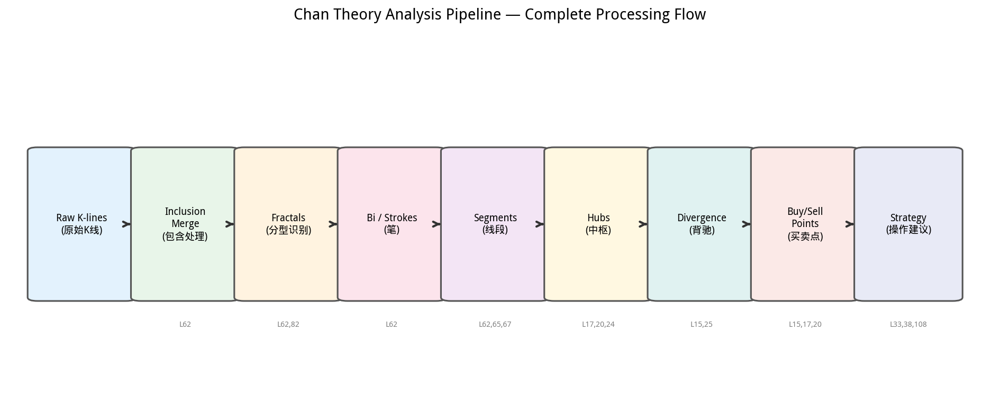

Every step in the pipeline flows strictly into the next. No step can be skipped. This is the complete processing flow as implemented in [`chan_theory/chan.py`](../chan_theory/chan.py) (the `ChanAnalyzer.analyze()` method).

---

## 2. Prerequisites: Understanding the A-Share Stock Market

Before diving into Chan Theory, you need to understand some basics about the **Chinese A-share market** (A股), since the framework was designed specifically for it.

### What are A-shares?

**A-shares (A股)** are shares of Chinese mainland companies, traded on the **Shanghai Stock Exchange (SSE, 上交所)** and the **Shenzhen Stock Exchange (SZSE, 深交所)**. They are denominated in Chinese Yuan (RMB/CNY).

### Key differences from Western markets

| Aspect | A-Share Market | US Market |
|--------|---------------|-----------|
| **Trading hours** | 9:30-11:30, 13:00-15:00 (Beijing time) | 9:30-16:00 ET |
| **Price limits** | ±10% daily limit (±20% for ChiNext) | No daily limit |
| **Settlement** | T+1 (buy today, sell tomorrow) | T+2 (but can day-trade) |
| **Short selling** | Very restricted | Widely available |
| **Dominance** | Retail investors (~80%) | Institutional investors |
| **Ticker format** | 600xxx (SSE), 000xxx (SZSE main), 300xxx (ChiNext), 002xxx (SME) | Letters: AAPL, TSLA |

### Stock codes used in this project

- **000001.SZ** — Ping An Bank (平安银行), on Shenzhen main board
- **300014.SZ** — EVE Energy (亿纬锂能), on ChiNext board
- **600519.SH** — Kweichow Moutai (贵州茅台), on Shanghai board

### Important terms

- **涨停 (zhǎng tíng)**: "limit up" — price hit the +10% daily ceiling, often can't buy
- **跌停 (diē tíng)**: "limit down" — price hit -10%, often can't sell
- **成交量 (volume)**: Extremely important. A-share traders watch volume closely
- **K线 (K xiàn)**: Candlestick chart, the fundamental visualization

---

## 3. K-lines: The Language of the Market

A **K-line (K线)** is a candlestick that shows the price movement within a single time period — one day, one week, 30 minutes, or any timeframe.

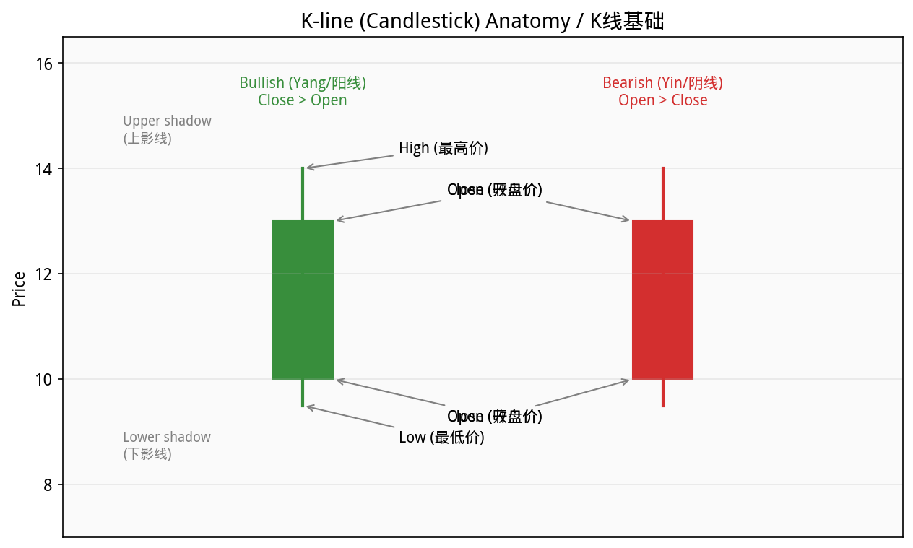

### Anatomy of one K-line

Each K-line has four key prices:

| Component | Chinese | Meaning |
|-----------|---------|---------|
| **Open (开盘价)** | 开 | The first trade price of the period |
| **Close (收盘价)** | 收 | The last trade price of the period |
| **High (最高价)** | 高 | The highest price reached |
| **Low (最低价)** | 低 | The lowest price reached |

**Color convention** (A-share standard):
- 🟥 **Red / hollow candle** = **Bullish (阳线)**: Close > Open (price went UP)
- 🟩 **Green / filled candle** = **Bearish (阴线)**: Open > Close (price went DOWN)

> ⚠️ **Note**: This is the **opposite** of the US convention where green=up and red=down. The Chinese/Japanese tradition uses red for prosperity (rise).

The **upper shadow (上影线)** = distance from the body to the high.
The **lower shadow (下影线)** = distance from the body to the low.

### In the code

```python
# From chan_theory/data_types.py
@dataclass
class RawKLine:
    index: int
    dt: str        # date/time string
    open: float
    close: float
    high: float
    low: float
    volume: float = 0.0
```

This is the input to the entire analysis system. Every data source (tushare, Ashare, CSV) converts its data into a list of `RawKLine` objects.

### Timeframes

The same analysis can be applied to any timeframe:
- **1-minute K-lines**: For very short-term trading
- **5-minute / 30-minute**: For intraday analysis
- **Daily K-lines (日线)**: The most common timeframe — our demo uses this
- **Weekly K-lines (周线)**: For higher-level context
- **Monthly K-lines (月线)**: For the biggest picture

The beauty of Chan Theory is that **the same rules apply at every timeframe**. This is called **self-similarity (自相似性)**.

---

## 4. Step 1: Inclusion Handling (包含处理)

**Source**: Lesson 62 | **Code**: [`chan_theory/kline_processor.py`](../chan_theory/kline_processor.py)

Before any analysis can begin, we must first clean the raw K-lines by handling **inclusion relationships (包含关系)**.

### What is inclusion?

Two consecutive K-lines have an **inclusion relationship** when one completely "contains" the other — its high is higher AND its low is lower (or equal).

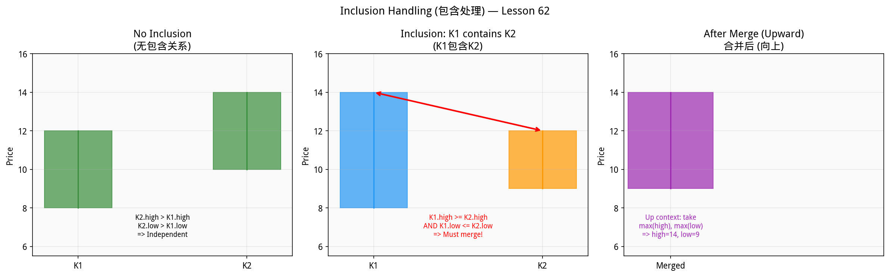

### The rule

When K-line A's range completely contains K-line B's range:
- `A.high >= B.high` AND `A.low <= B.low`

...or vice versa, they MUST be **merged** before any further analysis.

### The merging rule (direction matters!)

The way you merge depends on the **current direction context**:

| Context | Merge Rule | Intuition |
|---------|------------|-----------|
| **Going UP** ↑ | Take `max(high)`, `max(low)` | In an uptrend, keep the highest extremes |
| **Going DOWN** ↓ | Take `min(high)`, `min(low)` | In a downtrend, keep the lowest extremes |

The direction context is determined by looking at the previous non-included K-line.

### Why is this necessary?

Without inclusion handling, the subsequent fractal detection would produce false signals. The inclusion creates an ambiguous K-line that belongs to neither a clear up nor a clear down movement. Merging resolves this ambiguity.

### In the code

```python
# From chan_theory/kline_processor.py

def _has_inclusion(k1: KLine, k2: KLine) -> bool:
    """Check if two K-lines have an inclusion relationship."""
    return (k1.high >= k2.high and k1.low <= k2.low) or \
           (k2.high >= k1.high and k2.low <= k1.low)

def _merge_klines(k1: KLine, k2: KLine, direction_up: bool) -> KLine:
    if direction_up:
        new_high = max(k1.high, k2.high)
        new_low = max(k1.low, k2.low)
    else:
        new_high = min(k1.high, k2.high)
        new_low = min(k1.low, k2.low)
    # ... creates merged KLine
```

After processing, the raw 500 K-lines might become ~400 processed K-lines. The merged K-lines track which original K-lines they contain in the `elements` field.

---

## 5. Step 2: Fractals (分型)

**Source**: Lessons 62, 82 | **Code**: [`chan_theory/fractal.py`](../chan_theory/fractal.py)

After inclusion processing, we detect **fractals (分型)** — the local turning-point patterns that define where price reverses direction.

### Two types of fractals

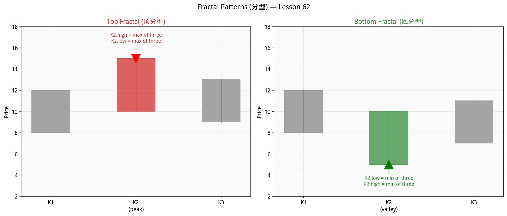

#### Top Fractal (顶分型) — marks a local peak

Three consecutive processed K-lines (K1, K2, K3) where:
- K2's high is the **highest** of all three
- K2's low is the **highest** of all three

In other words, K2 sticks UP above both neighbors.

#### Bottom Fractal (底分型) — marks a local valley

Three consecutive processed K-lines where:
- K2's low is the **lowest** of all three
- K2's high is the **lowest** of all three

K2 dips DOWN below both neighbors.

### Alternation rule

Fractals must **strictly alternate**: Top → Bottom → Top → Bottom → ...

When two consecutive same-type fractals appear (e.g., two tops), only the more extreme one is kept:
- Two tops → keep the higher one
- Two bottoms → keep the lower one

### Fractal strength (Lesson 82)

Not all fractals are equal. **Lesson 82** introduces fractal strength classification:

| Strength | Meaning | How to detect |
|----------|---------|---------------|
| **Strong (强分型)** | Likely reversal | K3 drops far below K2's midpoint (for top fractal) |
| **Weak (弱分型)** | Likely continuation | K3 barely moves from K2 |
| **Normal (普通分型)** | Ambiguous | Somewhere in between |

```python
# From chan_theory/fractal.py
def analyze_fractal_strength(fractal: Fractal) -> FractalStrength:
    # For a top fractal:
    # drop_ratio = how far K3 dropped relative to K2's range
    # If drop_ratio > 0.7 and K3 closes below K2 midpoint => STRONG
    # If drop_ratio < 0.3 and K3 stays above K2 midpoint  => WEAK
```

**Practical meaning**: A strong top fractal means the sellers are truly in control — the next move down is likely real. A weak top fractal might be a fake-out.

---

## 6. Step 3: Bi / Strokes (笔)

**Source**: Lesson 62 | **Code**: [`chan_theory/bi.py`](../chan_theory/bi.py)

A **Bi (笔)**, or "stroke", is the fundamental building block of Chan Theory. It's a straight line connecting two adjacent alternating fractals.

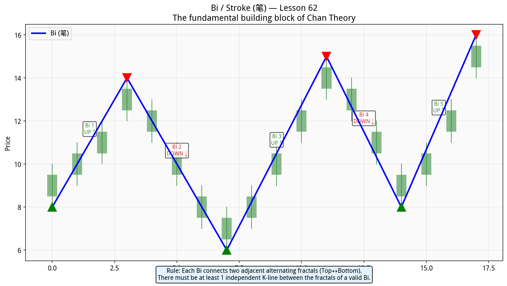

### Definition

- **Ascending Bi (上升笔)**: Bottom Fractal → Top Fractal (price goes up)
- **Descending Bi (下降笔)**: Top Fractal → Bottom Fractal (price goes down)

### The minimum requirement

A valid Bi requires **at least 1 independent K-line** between the two fractals. Since each fractal uses 3 K-lines (and adjacent fractals can share a K-line), this means the gap between the K2 points of two fractals must be ≥ 3 K-lines.

### Why Bi matters

The Bi is the **smallest analyzable unit** of price movement. Every complex market movement — no matter how chaotic it looks — can be decomposed into a sequence of Bi:

```
↑ ↓ ↑ ↓ ↑ ↓ ↑ ...
```

This zigzag sequence is then used to detect higher-level structures (segments, hubs).

### In the code

```python
# From chan_theory/bi.py
def construct_bis(fractals, klines):
    # For each pair of adjacent fractals:
    #   1. Determine direction (BOTTOM→TOP = UP, TOP→BOTTOM = DOWN)
    #   2. Validate minimum gap (k2 distance >= 3)
    #   3. Create Bi object with the K-lines in between
```

### Key properties of a Bi

```python
bi.direction   # UP or DOWN
bi.high        # The highest price in this stroke
bi.low         # The lowest price in this stroke
bi.change      # abs(high - low) = magnitude of the move
bi.length      # Number of K-lines in this Bi
```

---

## 7. Step 4: Segments (线段)

**Source**: Lessons 62, 65, 67, 71, 77, 78 | **Code**: [`chan_theory/segment.py`](../chan_theory/segment.py)

A **Segment (线段)** is a larger-scale directional movement composed of **at least 3 Bi**.

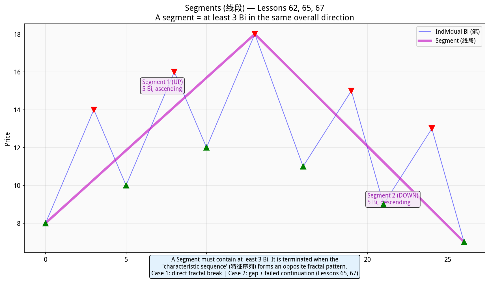

### The characteristic sequence method (特征序列法)

This is one of the most mathematically precise aspects of Chan Theory. To determine when a segment ends, you use the **characteristic sequence**:

- For an **UP segment**: look at the **descending Bi** as the characteristic sequence
- For a **DOWN segment**: look at the **ascending Bi** as the characteristic sequence

When the characteristic sequence itself forms a fractal pattern (a top for up segments, a bottom for down segments), the segment is terminated.

### Two termination cases

**Case 1 (Lesson 65)**: The characteristic sequence directly forms a fractal:
- In an UP segment, when a descending Bi breaks below the previous descending Bi's low → the segment is over

**Case 2 (Lesson 67)**: A gap exists in the characteristic sequence, but the next element continuing the original direction also fails:
- More complex, but catches segment terminations that Case 1 misses

### In the code

```python
# From chan_theory/segment.py
def _check_segment_termination(bis, direction):
    # Case 1: characteristic sequence directly forms opposite fractal
    # Case 2: gap in characteristic sequence + failed continuation
    # Returns: (should_terminate, case_type)
```

### Segment standardization (Lesson 78)

After construction, segments are **standardized** so their endpoints reflect the true extremes:
- An UP segment's end should be at the highest point
- A DOWN segment's end should be at the lowest point

### Why segments matter

Segments are the building blocks for **higher-level hub detection**. While Bi-level hubs are common and frequent, **segment-level hubs** indicate much more significant market structures.

---

## 8. Step 5: Central Hubs (中枢) — The Core of Everything

**Source**: Lessons 17, 20, 24, 25, 33, 36, 70 | **Code**: [`chan_theory/hub.py`](../chan_theory/hub.py)

The **Central Hub (中枢)** is arguably the single most important concept in all of Chan Theory. It is the **center of gravity** around which price oscillates.

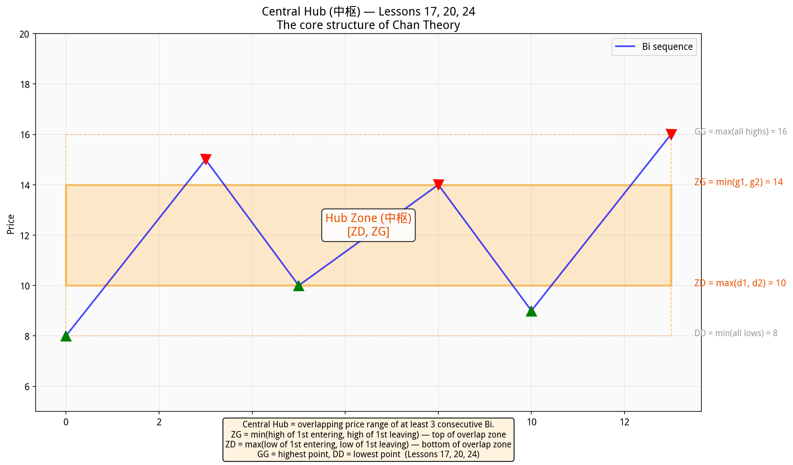

### Definition (Lesson 17)

A hub is the **overlapping price range** of at least 3 consecutive sub-level movements (Bi or segments).

### The four key values (Lesson 20)

Given 3 consecutive Bi with highs g₁, g₂, g₃ and lows d₁, d₂, d₃:

| Value | Formula | Meaning |
|-------|---------|---------|
| **ZG** | min(g₁, g₃) | Top of the overlap zone — "ceiling" of the hub |
| **ZD** | max(d₁, d₃) | Bottom of the overlap zone — "floor" of the hub |
| **GG** | max(all highs) | Absolute highest price reached |
| **DD** | min(all lows) | Absolute lowest price reached |

The hub is **valid** only when `ZG > ZD` (the overlapping zone actually exists).

### Why ZG and ZD matter

The hub zone [ZD, ZG] is where the **balance of power** between buyers and sellers is contested:
- When price is **above ZG**: buyers are winning (temporarily)
- When price is **below ZD**: sellers are winning (temporarily)
- When price is **between ZD and ZG**: the market is undecided

**All buy/sell points are defined relative to hub boundaries.** This is what makes Chan Theory structural rather than indicator-based.

### In the code

```python
# From chan_theory/hub.py
def detect_hubs_from_bis(bis):
    # For each group of 3 consecutive Bi:
    #   1. Check if overlap exists (overlap_top > overlap_bottom)
    #   2. Calculate ZG = min(b1.high, b3.high), ZD = max(b1.low, b3.low)
    #   3. Try extending with subsequent Bi that overlap [ZD, ZG]
    #   4. Track GG, DD, extension count
```

### Two levels of hubs

The system detects hubs at two levels:
1. **Bi-level hubs** (`detect_hubs_from_bis`): Built from strokes — more frequent, smaller significance
2. **Segment-level hubs** (`detect_hubs_from_segments`): Built from segments — less frequent, greater significance

---

## 9. Trend vs Consolidation (趋势与盘整)

**Source**: Lesson 17 | **Code**: [`chan_theory/hub.py → classify_trend()`](../chan_theory/hub.py)

Once we have hubs, we can classify the market state with mathematical precision.

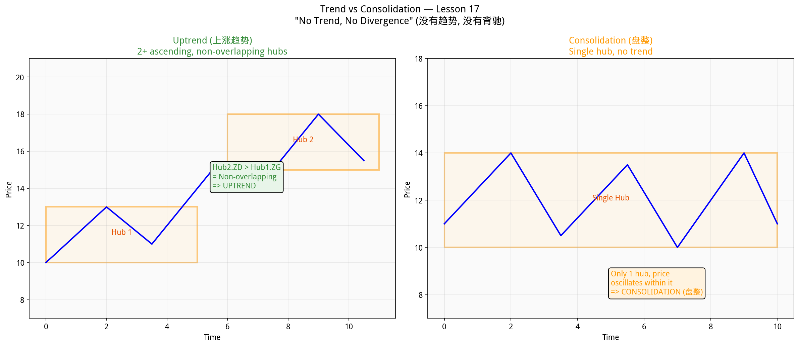

### The classification

| Condition | Classification | Chinese |
|-----------|---------------|---------|
| **0 hubs** | Unknown / too little data | 未知 |
| **1 hub** | **Consolidation (盘整)** | 盘整 — price oscillates within hub |
| **2+ ascending, non-overlapping hubs** | **Uptrend (上涨趋势)** | Hub2.ZD > Hub1.ZG |
| **2+ descending, non-overlapping hubs** | **Downtrend (下跌趋势)** | Hub2.ZG < Hub1.ZD |

### The critical principle: "走势必完美" (All trends must complete)

**Lesson 17** establishes the most fundamental theorem of Chan Theory:

> **Every trend type MUST complete.** An uptrend cannot go on forever. A downtrend cannot go on forever. A consolidation must eventually resolve. This isn't a prediction — it's a mathematical certainty.

This means: when you're in a downtrend, you know with certainty that it **will** end. The only question is **when** — and that's what divergence analysis answers.

### Why "No Trend, No Divergence" matters

This is a common beginner mistake: looking for divergence in a consolidation. Chan Theory explicitly states:

> **没有趋势，没有背驰** — divergence (背驰) ONLY applies to trends. In a consolidation, you use hub oscillation trading instead.

---

## 10. Divergence (背驰) — Predicting Reversals

**Source**: Lessons 15, 25 | **Code**: [`chan_theory/divergence.py`](../chan_theory/divergence.py)

**Divergence (背驰)** is how Chan Theory predicts when a trend is about to reverse. It is perhaps the most practically useful concept.

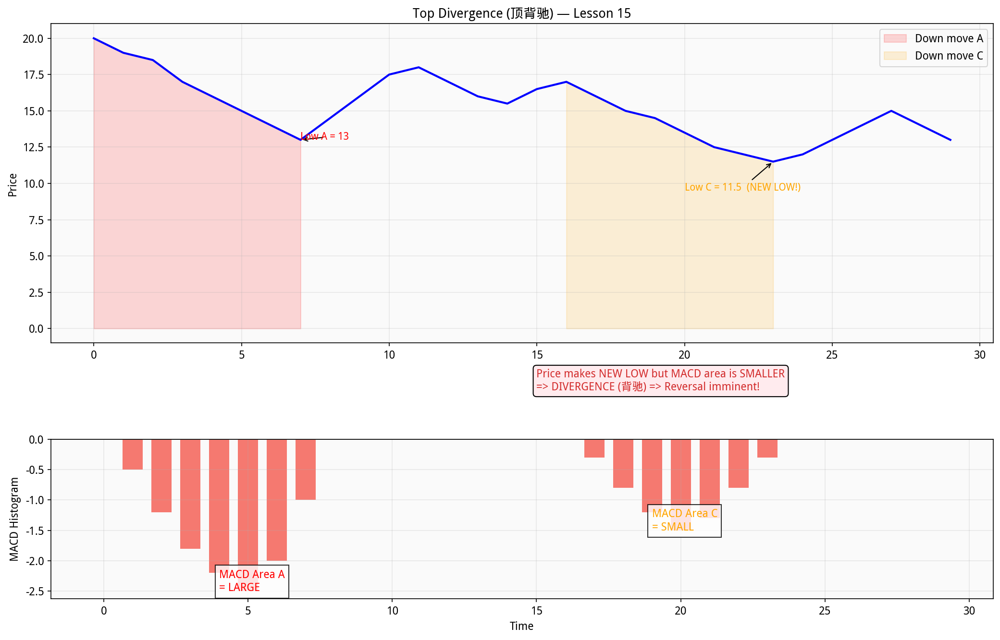

### What is divergence?

Divergence occurs when **price makes a new extreme** (new high or new low), but the **momentum (measured by MACD) is weaker** than the previous move in the same direction.

In plain English: "The market is still going up/down, but with less and less energy. It's about to run out of steam."

### How to measure it: MACD (Lesson 25)

Chan Theory uses **MACD** (Moving Average Convergence Divergence) as the primary tool for measuring trend force:

- **Parameters**: 12, 26, 9 (explicitly specified in Lesson 25)
- **DIF** = 12-period EMA − 26-period EMA
- **DEA** = 9-period EMA of DIF (the "signal line")
- **Histogram** = 2 × (DIF − DEA)

The **MACD histogram area** between two zero-crosses represents the **strength (力度)** of a trend movement.

### Divergence detection algorithm

1. Find two consecutive same-direction moves (e.g., two down-moves separated by a bounce)
2. Calculate the MACD histogram area for each
3. Compare:
   - If **price makes new low** but **MACD area is SMALLER** → **Bottom divergence** (下跌背驰) → BUY signal
   - If **price makes new high** but **MACD area is SMALLER** → **Top divergence** (上涨背驰) → SELL signal

### Trend force (趋势力度) — Lesson 15

A more fundamental measure of trend strength (before MACD was introduced) is the **area between the short-term and long-term moving averages** between consecutive "kisses" (crosses):

```python
# From chan_theory/divergence.py
def compute_trend_force(closes, short_period=5, long_period=10, start=0, end=None):
    short_ma = compute_ema(segment, short_period)
    long_ma = compute_ema(segment, long_period)
    return sum(abs(s - l) for s, l in zip(short_ma, long_ma))
```

### In the code

```python
# From chan_theory/divergence.py
def detect_divergence(highs, lows, closes, bis_ranges):
    _, _, histogram = compute_macd(closes)
    # For each pair of same-direction Bi:
    #   curr_area = MACD area of current move
    #   prev_area = MACD area of previous same-direction move
    #   If price new extreme but curr_area < prev_area => DIVERGENCE
```

---

## 11. The Three Classes of Buy/Sell Points (三类买卖点)

**Source**: Lessons 15, 17, 20, 21 | **Code**: [`chan_theory/signals.py`](../chan_theory/signals.py)

This is where the theory becomes directly actionable. Chan Theory defines **exactly three classes** of buy points and their mirror sell points.

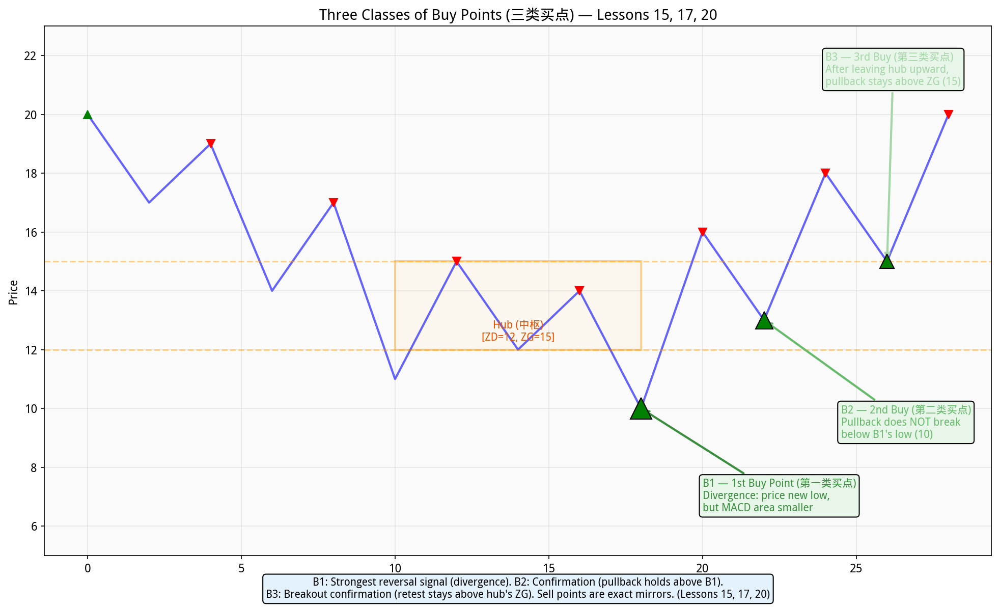

### First Class Buy Point (第一类买点, B1) — Lesson 15

**The strongest signal.** Occurs at the endpoint of a downtrend with divergence.

**Conditions**:
- The market is in a **downtrend** (2+ descending hubs)
- The latest down-move shows **MACD divergence** vs the previous down-move
- Price makes a new low, but MACD area is smaller

**Meaning**: "The downtrend has exhausted itself. This is the absolute bottom."

**Risk**: Highest potential reward, but also the hardest to catch. You're buying against the prevailing trend.

### Second Class Buy Point (第二类买点, B2) — Lesson 17

**The confirmation signal.** Occurs after a B1, when the subsequent pullback holds above the B1 low.

**Conditions**:
- A B1 has already been identified
- After the initial rise following B1, there's a pullback
- This pullback's low is **higher** than the B1's price → **the reversal is confirmed**

**Meaning**: "The reversal from B1 is real. This pullback is a safer entry."

**Risk**: Less reward than B1 (you buy higher), but much safer — the reversal is confirmed.

### Third Class Buy Point (第三类买点, B3) — Lesson 20

**The breakout confirmation.** Occurs after price leaves a hub upward, pulls back, but stays above the hub's ZG.

**Conditions**:
- Price breaks **above** a hub's ZG (leaves the hub upward)
- A subsequent pullback occurs
- The pullback's low stays **at or above ZG** → confirming the breakout

**Meaning**: "The market has decisively broken out of the consolidation zone."

**Risk**: Lowest reward (you buy after the breakout), but the highest probability. Failed B3s (price falls back below ZG) are used as stop-loss triggers.

### Sell Points (卖点) — Mirror of buy points

| Sell Point | Mirror of | Condition |
|------------|-----------|-----------|
| **S1 (第一类卖点)** | B1 | Divergence at top of uptrend |
| **S2 (第二类卖点)** | B2 | Rally after S1 fails to reach S1's high |
| **S3 (第三类卖点)** | B3 | After leaving hub downward, bounce stays below ZD |

### The Completeness Theorem (Lesson 21)

> **All price movements begin and end at buy/sell points.**

This means every decline starts from a sell point and ends at a buy point, and every rally starts from a buy point and ends at a sell point. There are no other possibilities.

### In the code

```python
# From chan_theory/signals.py

def _detect_1st_class(bis, closes):
    # Compare MACD areas of consecutive same-direction Bi
    # If divergence found → B1 or S1

def _detect_2nd_class(bis, first_class_signals):
    # After B1: look for next pullback where low > B1.price → B2
    # After S1: look for next rally where high < S1.price → S2

def _detect_3rd_class(bis, hubs):
    # After hub: look for departure + retest
    # Up departure + retest stays above ZG → B3
    # Down departure + retest stays below ZD → S3
```

---

## 12. Hub Extension, Expansion & Migration

**Source**: Lessons 25, 36, 70 | **Code**: [`chan_theory/hub.py`](../chan_theory/hub.py)

Hubs are not static — they evolve over time through three mechanisms.

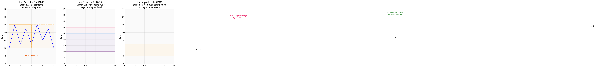

### Hub Extension (中枢延伸) — Lesson 25

When subsequent movements (Bi or segments) **continue to overlap** with the hub's [ZD, ZG] range, the hub **extends**.

- An extended hub means the consolidation is ongoing
- When extension reaches **9+ elements**, the hub effectively undergoes a **level upgrade** — it becomes a higher-level structure

```python
# In hub detection code:
if next_bi.high >= ZD and next_bi.low <= ZG:
    hub_elements.append(next_bi)  # Hub extends
    extension_count += 1
```

### Hub Expansion (中枢扩展) — Lesson 36

When **two adjacent same-level hubs overlap**, they **merge** into a **higher-level hub**.

This is how market structure scales up:
- Two bi-level hubs that overlap → one segment-level hub
- Two segment-level hubs that overlap → one even higher-level hub

```python
# From chan_theory/hub.py
def _check_hub_expansion(hubs):
    # If prev_hub.overlaps(curr_hub) → merge into higher-level hub
    # The new hub has: level = max(prev.level, curr.level) + 1
```

### Hub Migration (中枢移动) — Lesson 70

When **non-overlapping hubs** keep moving in the same direction, this is **hub migration** — a sign of a strong trend.

- Three ascending, non-overlapping hubs → very strong uptrend
- The center-to-center shift tells you the trend's velocity

---

## 13. After Divergence: Three Possible Outcomes (Lesson 29)

**Source**: Lesson 29 | **Code**: [`chan_theory/strategies.py → classify_post_divergence()`](../chan_theory/strategies.py)

After a divergence signal (B1 or S1), exactly **three outcomes** are possible. Understanding this is critical for position management.

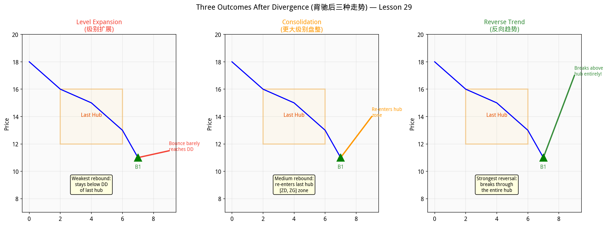

Given the standard pattern **a + A + b + B + c** (where A and B are hubs, and a, b, c are connecting movements):

### Outcome 1: Level Expansion (级别扩展) — Weakest

The rebound after divergence is **so weak** it doesn't even reach the bottom (DD) of the last hub.

**What it means**: The reversal failed. The downtrend is continuing with expanded structure.
**Action**: Don't buy, or exit immediately if you bought at B1.

### Outcome 2: Larger Consolidation (更大级别盘整)

The rebound after divergence **re-enters the last hub** but doesn't break through to the other side.

**What it means**: The downtrend has paused, but hasn't reversed into an uptrend. Expect more sideways action.
**Action**: Can trade the consolidation (buy low, sell high within the hub), but don't expect a big rally.

### Outcome 3: Reverse Trend (反向趋势) — Strongest

The rebound after divergence **breaks completely through the last hub** to the other side.

**What it means**: A genuine trend reversal. The downtrend is over and an uptrend has begun.
**Action**: This is the best outcome. Hold the position and look for B2/B3 to add more.

```python
# From chan_theory/strategies.py
def classify_post_divergence(current_bi, last_hub):
    if current_bi.high < last_hub.DD:
        return PostDivergenceOutcome.LEVEL_EXPANSION    # Weakest
    elif current_bi.high <= last_hub.ZG:
        return PostDivergenceOutcome.CONSOLIDATION       # Medium
    else:
        return PostDivergenceOutcome.REVERSE_TREND       # Strongest
```

---

## 14. Auxiliary Indicators: MA Kisses, Bollinger, Gaps

### MA Kisses (均线吻) — Lesson 15

**Code**: [`chan_theory/indicators.py → classify_ma_kisses()`](../chan_theory/indicators.py)

The way short-term and long-term moving averages interact reveals the type of trend energy:

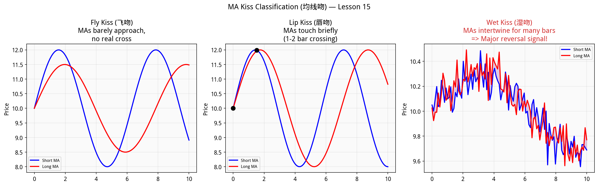

| Type | Chinese | Pattern | Significance |
|------|---------|---------|--------------|
| **Fly Kiss (飞吻)** | 飞吻 | MAs barely approach, no real cross | Weak interaction, trend continues |
| **Lip Kiss (唇吻)** | 唇吻 | MAs touch briefly (1-2 bars) | Brief pause, trend may continue |
| **Wet Kiss (湿吻)** | 湿吻 | MAs intertwine for many bars | **Major reversal precursor!** |

> **Key insight from Lesson 15**: All major trend reversals begin with a "wet kiss" — a prolonged intertwining of MAs that indicates the old trend's energy has been completely absorbed.

### Bollinger Bands (布林通道) — Lesson 90

**Code**: [`chan_theory/indicators.py → compute_bollinger_bands()`](../chan_theory/indicators.py)

Parameters: 20-period SMA ± 2 standard deviations.

Bollinger Band **contraction** signals the end of hub consolidation (called the **"中阴阶段"** or "middle-yin phase" in Lesson 90). When the bands narrow dramatically, a breakout is imminent.

```python
def detect_boll_contraction(upper, lower, window=10, threshold=0.5):
    # When current bandwidth < 50% of bandwidth 10 periods ago
    # → Contraction = imminent breakout
```

### Gap Analysis (缺口分析) — Lesson 77

**Code**: [`chan_theory/indicators.py → detect_gaps()`](../chan_theory/indicators.py)

A **gap (缺口)** occurs when today's low is above yesterday's high (up gap) or today's high is below yesterday's low (down gap).

Four types:

| Type | Chinese | Filled? | Meaning |
|------|---------|---------|---------|
| **Breakthrough (突破缺口)** | 突破缺口 | Rarely | Marks the START of a new trend |
| **Continuation (中继缺口)** | 中继缺口 | ~50% | Mid-trend, confirms direction |
| **Exhaustion (竭尽缺口)** | 竭尽缺口 | Always | Marks the END of a trend |
| **Ordinary (普通缺口)** | 普通缺口 | Almost always | Just hub oscillation noise |

---

## 15. Multi-Level Analysis & Interval Nesting (区间套)

**Source**: Lessons 37, 52, 53, 60, 81 | **Code**: [`chan_theory/multi_level.py`](../chan_theory/multi_level.py)

This is Chan Theory's answer to multi-timeframe analysis — and it's far more rigorous than how most traders do it.

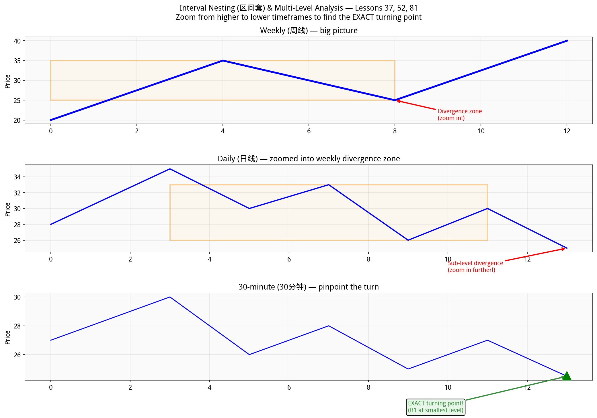

### Interval Nesting (区间套) — Lesson 37

The core idea: when you detect a divergence at a **higher timeframe**, you can pinpoint the **exact turning point** by zooming into lower timeframes:

1. **Weekly chart**: Identify divergence zone (rough area)
2. **Daily chart**: Find sub-level divergence within that zone (narrows the area)
3. **30-minute chart**: Find sub-sub-level divergence (pinpoints the turn)
4. **5-minute chart**: Even finer precision if needed

This creates a **nested set of converging intervals** — hence "interval nesting."

### Level Resonance (级别共振) — Lesson 53

When **multiple timeframes simultaneously** show buy/sell signals, the resulting move is **much more powerful**.

Example: If the daily chart shows B1 AND the weekly chart shows B2, the subsequent rally will be much stronger than if only the daily chart had a signal.

```python
# From chan_theory/multi_level.py
def level_resonance(self):
    # Check if latest signals across levels are aligned
    # If daily + weekly both show buy signals → "buy resonance" → very bullish
```

### In practice (our demo)

```python
# From demo_ashare.py
ml = MultiLevelAnalyzer()
ml.add_level("daily", daily_klines)
ml.add_level("weekly", weekly_klines)

# Interval nesting: find precise turns
nesting = ml.interval_nesting()

# Level resonance: find powerful aligned signals
resonance = ml.level_resonance()
```

---

## 16. Trading Strategies

**Source**: Lessons 33, 38, 45, 48, 53, 68, 108 | **Code**: [`chan_theory/strategies.py`](../chan_theory/strategies.py)

### Strategy 1: Hub Oscillation Trading (中枢震荡交易) — Lesson 33

The most basic strategy. When price is oscillating within a hub:

- **Buy** when price leaves the hub **downward** and shows divergence (weakening down-move)
- **Sell** when price leaves the hub **upward** and shows divergence (weakening up-move)
- If a **B3 appears** after you sell, re-enter immediately

This is low-risk, low-reward — you're range-trading within the hub's [DD, GG] boundaries.

### Strategy 2: Mechanical Same-Level Trading (同级别分解机械化操作) — Lesson 38

The most reliable strategy. Fully mechanical with no discretion:

1. When you detect **down-divergence** → BUY (full position)
2. Hold until **up-divergence** appears → SELL (full position)
3. Repeat like a machine

```python
# From chan_theory/strategies.py
def mechanical_trading_signals(bis, hubs, closes):
    # Fully mechanical: buy at down-divergence, sell at up-divergence
    # No discretion, no emotion — pure divergence-based switching
```

### Strategy 3: Three-Phase Model (三段走势分类) — Lesson 108

The final lesson synthesizes everything into a three-phase model:

| Phase | Name | Meaning | Action |
|-------|------|---------|--------|
| **Phase 1** | Bottom construction (底部构造) | First hub forming after downtrend | Be cautious, start small positions |
| **Phase 2** | Middle connection (中间连接) | Trend developing between hubs | Hold position, follow the trend |
| **Phase 3** | Top construction (顶部构造) | Final hub forming before reversal | Prepare to exit, watch for S1 |

### Trend Completion Monitor (走势必完美)

The system actively monitors where the current market is in its trend lifecycle:

```python
# From chan_theory/strategies.py
class TrendStatus:
    FORMING      # Trend just starting, no hub yet
    HUB_FORMED   # First hub completed
    EXTENDING    # Hub is extending (consolidation continues)
    DIVERGING    # Divergence segment appearing (end game!)
    COMPLETING   # Trend about to finish
    COMPLETED    # Trend has completed
```

---

## 17. Complete Pipeline: Putting It All Together

Here's the entire analysis flow as executed by `ChanAnalyzer.analyze()` in [`chan_theory/chan.py`](../chan_theory/chan.py):

```
Step  1: process_inclusion()        → Raw K-lines become processed K-lines
Step  2: detect_fractals()          → Find all top/bottom fractals
Step  3: analyze_fractal_strength() → Rate each fractal (strong/weak/normal)
Step  4: construct_bis()            → Build strokes from fractals
Step  5: construct_segments()       → Build segments from strokes (Case 1/2)
Step  6: detect_hubs_from_bis()     → Find bi-level hubs (+ extension/expansion)
         detect_hubs_from_segments()→ Find segment-level hubs
Step  7: detect_hub_migration()     → Track hub migration patterns
Step  8: compute_macd()             → MACD with 12, 26, 9 parameters
Step  9: Bollinger, MA kisses, gaps → Auxiliary indicators
Step 10: detect_signals()           → Three classes of buy/sell points
Step 11: classify_trend()           → Uptrend / Downtrend / Consolidation
Step 12: monitor_trend_completion() → Track "走势必完美" status
Step 13: strategy_signals()         → Concrete trading recommendations
Step 14: three_phase_analysis()     → Bottom / Middle / Top classification
```

### The summary output

After `analyzer.analyze()`, calling `analyzer.summary()` gives you:

```python
{
    "raw_klines": 500,          # Original data points
    "processed_klines": 412,    # After inclusion merge
    "fractals": 89,             # Top + bottom fractals found
    "bis": 33,                  # Strokes constructed
    "segments": 5,              # Segments detected
    "hubs_bi_level": 4,         # Bi-level hubs
    "hubs_seg_level": 1,        # Segment-level hubs
    "signals": 5,               # Buy/sell points
    "trend_type": "UPTREND",    # Current trend classification
    "trend_status": "DIVERGING",# Trend completion status
    "phase": "top",             # Three-phase position
    "phase_action": "caution",  # Recommended action
    "signal_details": [...],    # Detailed signal info
    "hub_details": [...],       # Hub ZG/ZD/level info
    "trade_recommendations": [...],  # Concrete trade signals
}
```

---

## 18. Running the Demo

### Prerequisites

```bash
cd /path/to/chzhshch-108-plus
pip install -r requirements.txt
# or with uv:
uv pip install -r requirements.txt
```

### Run with real A-share data (via Ashare — free, no token needed)

```bash
python demo_ashare.py
```

This will:
1. Fetch 500 real daily K-lines for **300014.SZ** (亿纬锂能 / EVE Energy)
2. Fetch weekly K-lines for multi-level analysis
3. Run the complete Chan Theory pipeline
4. Print a comprehensive analysis report
5. Generate chart: `chan_analysis_300014_SZ.png`

### Run with synthetic data (no internet needed)

```bash
python demo.py
```

### Run with your own stock

Edit `demo_ashare.py` and change the `ts_code` variable:
```python
ts_code = "600519.SH"  # Kweichow Moutai
# or
ts_code = "000001.SZ"  # Ping An Bank
```

### What to look at in the output

1. **Trend type**: Is the stock in an uptrend, downtrend, or consolidation?
2. **Phase**: Bottom, middle, or top? This tells you where in the cycle you are.
3. **Signals**: Any B1/B2/B3 (buy) or S1/S2/S3 (sell) signals?
4. **Hub structure**: How many hubs? Are they migrating? Expanding?
5. **MACD divergence ratio**: The closer to 0, the stronger the divergence signal.

---

## 19. Quick Reference: Lesson-to-Code Mapping

| Lessons | Concept | Code File | Key Function |
|---------|---------|-----------|--------------|
| 62 | K-line inclusion (包含处理) | `kline_processor.py` | `process_inclusion()` |
| 62, 82 | Fractals (分型) | `fractal.py` | `detect_fractals()` |
| 82 | Fractal strength | `fractal.py` | `analyze_fractal_strength()` |
| 62 | Bi / Strokes (笔) | `bi.py` | `construct_bis()` |
| 62, 65, 67, 77, 78 | Segments (线段) | `segment.py` | `construct_segments()` |
| 17, 20, 24 | Hub detection (中枢) | `hub.py` | `detect_hubs_from_bis()` |
| 25 | Hub extension | `hub.py` | `detect_hubs_from_bis()` (extension loop) |
| 36 | Hub expansion | `hub.py` | `_check_hub_expansion()` |
| 70 | Hub migration | `hub.py` | `detect_hub_migration()` |
| 17 | Trend classification | `hub.py` | `classify_trend()` |
| 15, 25 | MACD & Divergence (背驰) | `divergence.py` | `detect_divergence()`, `compute_macd()` |
| 15 | Trend force (趋势力度) | `divergence.py` | `compute_trend_force()` |
| 15, 17, 20 | Buy/sell points (买卖点) | `signals.py` | `detect_signals()` |
| 21 | Completeness theorem | `signals.py` | (enforced by structure) |
| 29 | Post-divergence outcomes | `strategies.py` | `classify_post_divergence()` |
| 33 | Hub oscillation trading | `strategies.py` | `hub_oscillation_signals()` |
| 38 | Mechanical trading | `strategies.py` | `mechanical_trading_signals()` |
| 17, 45 | Trend monitor (走势必完美) | `strategies.py` | `monitor_trend_completion()` |
| 108 | Three-phase model | `strategies.py` | `three_phase_analysis()` |
| 37, 52, 60 | Interval nesting (区间套) | `multi_level.py` | `interval_nesting()` |
| 53 | Level resonance (级别共振) | `multi_level.py` | `level_resonance()` |
| 81 | Multi-level joint analysis | `multi_level.py` | `MultiLevelAnalyzer` |
| 15 | MA Kiss classification | `indicators.py` | `classify_ma_kisses()` |
| 90 | Bollinger Bands | `indicators.py` | `compute_bollinger_bands()` |
| 77 | Gap analysis (缺口) | `indicators.py` | `detect_gaps()` |

---

## Glossary

| English | Chinese | Pinyin | Meaning in Chan Theory |
|---------|---------|--------|----------------------|
| K-line | K线 | K xiàn | Candlestick |
| Inclusion | 包含 | bāo hán | One K-line's range contains another |
| Fractal | 分型 | fēn xíng | Three-K-line reversal pattern |
| Bi / Stroke | 笔 | bǐ | The smallest price movement unit |
| Segment | 线段 | xiàn duàn | A movement of at least 3 Bi |
| Central Hub | 中枢 | zhōng shū | The overlapping price range of 3+ sub-level movements |
| Trend | 趋势 | qū shì | 2+ non-overlapping same-direction hubs |
| Consolidation | 盘整 | pán zhěng | Single-hub price oscillation |
| Divergence | 背驰 | bèi chí | Price new extreme but momentum weaker |
| Buy point | 买点 | mǎi diǎn | Point where buying is indicated |
| Sell point | 卖点 | mài diǎn | Point where selling is indicated |
| Interval nesting | 区间套 | qū jiān tào | Multi-level zoom-in technique |
| Level resonance | 级别共振 | jí bié gòng zhèn | Multiple timeframes agree |
| Hub extension | 中枢延伸 | zhōng shū yán shēn | Hub grows by adding elements |
| Hub expansion | 中枢扩展 | zhōng shū kuò zhǎn | Two hubs merge into higher level |
| Hub migration | 中枢移动 | zhōng shū yí dòng | Hubs move in one direction |
| "Trends must complete" | 走势必完美 | zǒu shì bì wán měi | The fundamental theorem |
| Characteristic sequence | 特征序列 | tè zhēng xù liè | Opposite-direction Bi used for segment analysis |
| Fly kiss | 飞吻 | fēi wěn | MAs barely approach |
| Lip kiss | 唇吻 | chún wěn | MAs touch briefly |
| Wet kiss | 湿吻 | shī wěn | MAs intertwine (reversal signal) |
| MACD area | MACD面积 | MACD miàn jī | Histogram area = trend strength |

---

*This tutorial covers the key concepts from the 108 lessons as implemented in this codebase. For the original lessons in Chinese, see the `108/` directory.*
